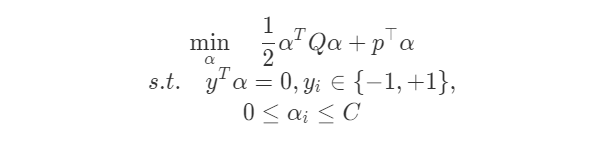
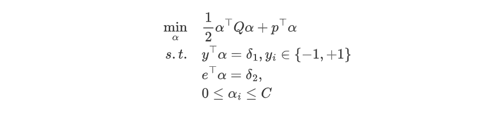
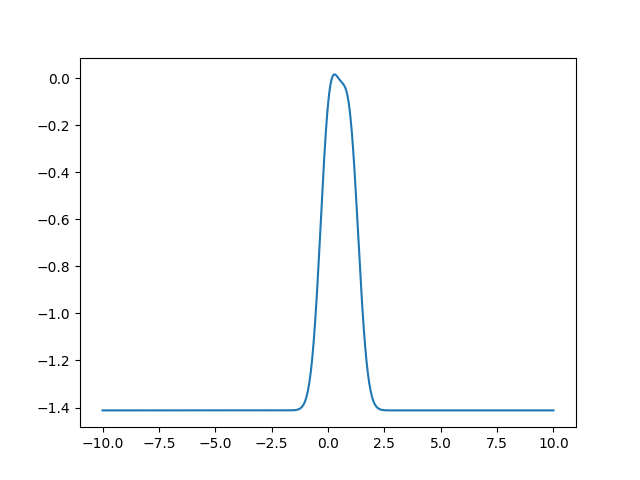

# PySVM

对标sklearn中的SVM模块

- [x] LinearSVC
- [x] SVC
- [x] NuSVC
- [x] LinearSVR
- [x] SVR
- [x] NuSVR
- [x] OneClassSVM

Python(numpy)实现SMO算法，也就是



和



的优化算法（[Solver类](./solver.py)和[NuSolver类](./solver.py)），从而实现支持向量机分类、回归以及异常检测。

## 文件结构

```bash
.
├── one_class.py # 异常检测：OneClassSVM
├── solver.py    # 求解线性约束二次规划问题的求解器：Solver, NuSolver
├── svc.py       # 二分类器：LinearSVC, KernelSVC, NuSVC
└── svr.py       # 回归方法：LinearSVR, KernelSVR, NuSVR
```

## 支持向量分类

我们实现了：线性支持向量分类（LinearSVC），带核支持向量分类（KernelSVC）以及用参数ν来控制支持向量个数的ν-SVC（NuSVC）

### LinearSVC

```python
from sklearn.datasets import *
from svc import LinearSVC
from sklearn.metrics import accuracy_score
from sklearn.model_selection import train_test_split

X, y = load_iris(return_X_y=True)
y[y != 0] = 1 # 转化为二分类数据
train_X, test_X, train_y, test_y = train_test_split(X, y, train_size=0.7)

model = LinearSVC(C=10)
model.fit(train_X, train_y)
pred = model.predict(test_X)
print(accuracy_score(test_y, pred))
```

输出100\%。

### KernelSVC

KernelSVC类实现了带核函数的支持向量分类（支持线性核、多项式核、Sigmoid核以及rbf核）：

```python
from sklearn.datasets import *
from svc import KernelSVC
from sklearn.metrics import accuracy_score
from sklearn.model_selection import train_test_split

X, y = load_breast_cancer(return_X_y=True)
X = (X - X.mean(0)) / X.std(0)
train_X, test_X, train_y, test_y = train_test_split(X, y, train_size=0.7)

model = KernelSVC() # 默认RBF核
model.fit(train_X, train_y)
pred = model.predict(test_X)
print(accuracy_score(test_y, pred))
```

准确率97\%+.

### NuSVC

NuSVC的参数与KernelSVC类似，只不过KernelSVC的C参数被nu代替。

### 多分类与调参

这里设计的分类模型都继承了`sklearn.base.BaseEstimator`，意味着它们可以和`sklearn`中的一些功能匹配，比如多分类和调参：

```python
from sklearn.multiclass import OneVsOneClassifier
from sklearn.datasets import load_digits
from sklearn.model_selection import train_test_split
from sklearn.metrics import accuracy_score
from svc import KernelSVC

X, y = load_digits(return_X_y=True)
X = (X - X.mean(0)) / (X.std(0) + 1e-8)
train_X, test_X, train_y, test_y = train_test_split(X, y, train_size=0.7)

base_model = KernelSVC(C=10)
multi_class = OneVsOneClassifier(base_model, n_jobs=4)
multi_class.fit(train_X, train_y)
pred = multi_class.predict(test_X)
print(accuracy_score(test_y, pred)) # 输出98%+
```

这里我们利用`sklearn.multiclass.OneVsOneClassifier`实现了对多类数据集的分类。

```python
from sklearn.model_selection import GridSearchCV
from sklearn.datasets import load_breast_cancer
from sklearn.model_selection import train_test_split
from sklearn.metrics import accuracy_score
from svc import NuSVC

X, y = load_breast_cancer(return_X_y=True)
X = (X - X.mean(0)) / (X.std(0) + 1e-8)
train_X, test_X, train_y, test_y = train_test_split(X, y, train_size=0.7)

base_model = NuSVC()
params = {"nu": [0.3, 0.5, 0.7]}
grid_model = GridSearchCV(base_model, params, verbose=3)
grid_model.fit(train_X, train_y)
pred = grid_model.best_estimator_.predict(test_X)
print("best param :", grid_model.best_params_)
print(accuracy_score(test_y, pred))
```

利用`sklearn.model_selection.GridSearchCV`进行调参。

## 支持向量回归

### LinearSVR

将$\alpha$和$\alpha^\star$整合成一个变量，实现支持向量回归：

```python
from svr import LinearSVR
from sklearn.datasets import *
from sklearn.model_selection import train_test_split
from sklearn.metrics import mean_squared_error

X, y = load_boston(return_X_y=True)
X = (X - X.mean(0)) / X.std(0)
train_X, test_X, train_y, test_y = train_test_split(X, y, train_size=0.7)
model = LinearSVR(max_iter=2000, epsilon=1, C=1)
model.fit(train_X, train_y)
pred = model.predict(test_X)
print(mean_squared_error(test_y, pred))
```

输出测试误差为24.49，与线性模型拟合的平均效果近似（[性能baseline参考](https://welts.xyz/2021/09/07/baseline/)），验证了我们的模型实现正确。

### KernelSVR

类似的，我们实现了支持多种核函数的SVR：

```python
from svr import LinearSVR, KernelSVR
from sklearn.datasets import *
from sklearn.model_selection import train_test_split
from sklearn.metrics import mean_squared_error

X, y = load_boston(return_X_y=True)
X = (X - X.mean(0)) / X.std(0)

train_X, test_X, train_y, test_y = train_test_split(X, y, train_size=0.7)

model = KernelSVR(max_iter=2000, epsilon=0.01, C=5, kernel='rbf')
model.fit(train_X, train_y)
pred = model.predict(test_X)
print(mean_squared_error(test_y, pred))
```

当设置为上面的参数时，我们将测试误差控制在10-20内，相比于LinearSVR性能更好。

### NuSVR

类似的，我们设计了用参数ν来控制支持向量个数的支持向量回归。

## 异常检测

One-class-SVM属于无监督算法，用于判断新数据是否离群：

```python
from one_class import OneClassSVM
import numpy as np
import matplotlib.pyplot as plt

X = [[0], [0.44], [0.45], [0.46], [1]]
model = OneClassSVM(nu=0.5)
model.fit(X)
data = np.linspace(-10, 10, 1000)
plt.plot(
    data,
    model.decision_function(data.reshape(-1, 1)),
)
plt.show()
```

给定数据`X`，然后利用决策函数来观察其附近的数据分布：



图像中只有决策函数值非负的点，才判定为不离群，否则离群。One-class-SVM也支持多种核函数，比如这里采用的就是RBF核。
