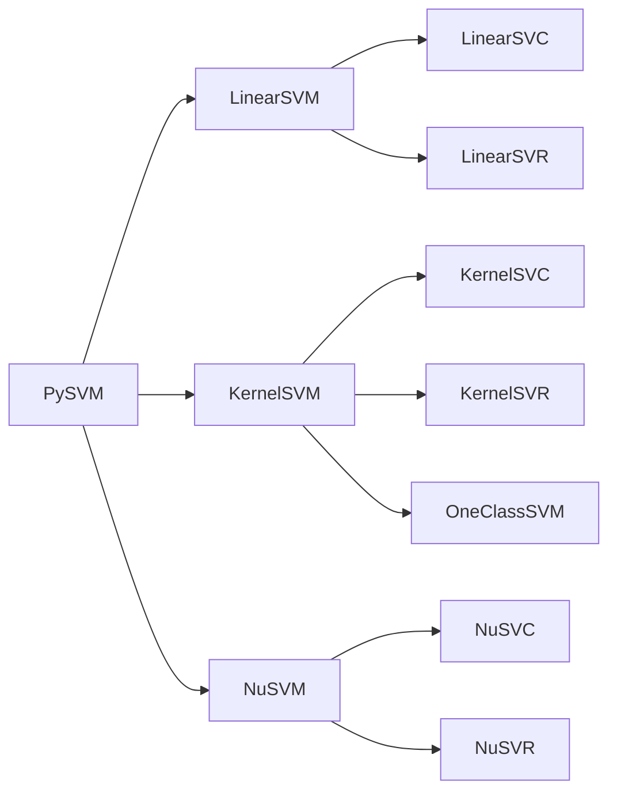
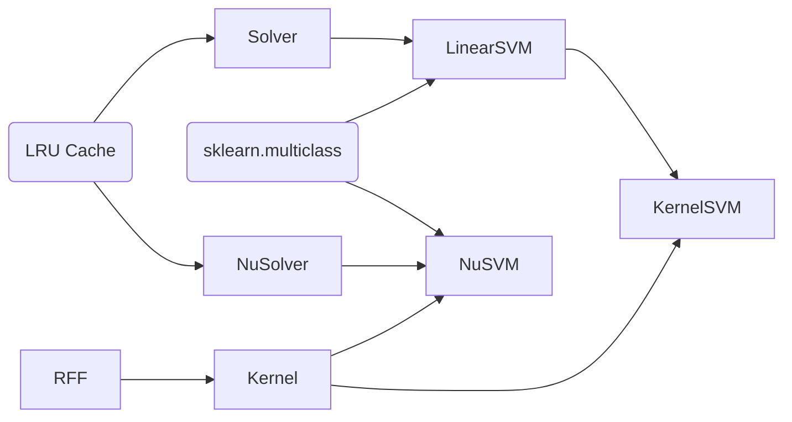
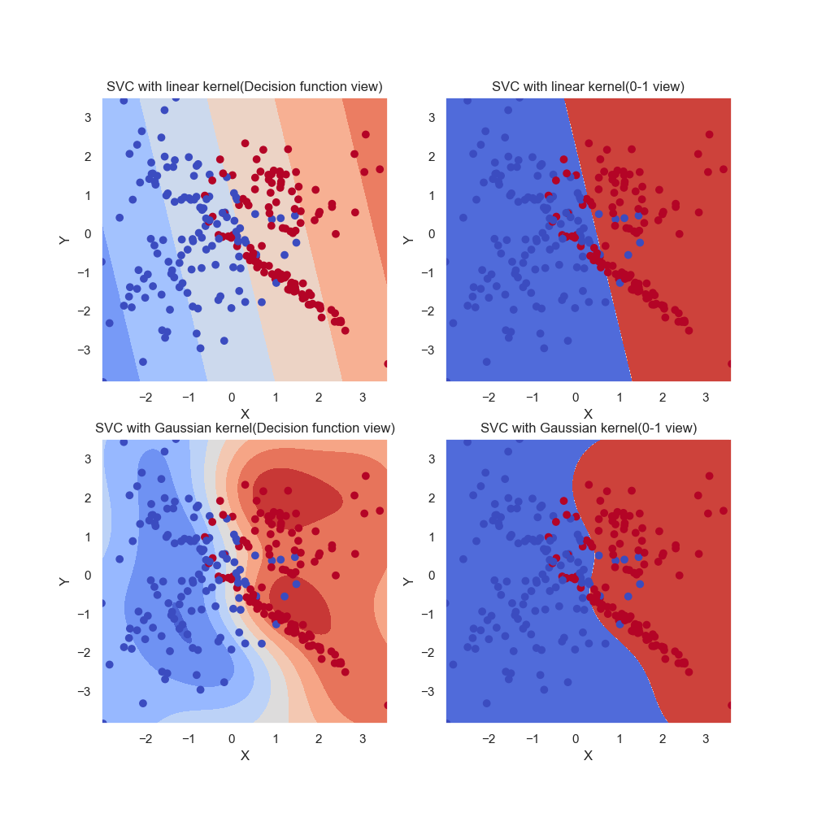
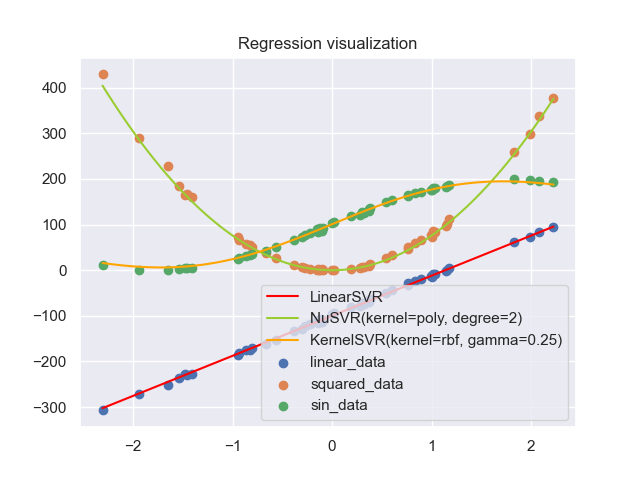
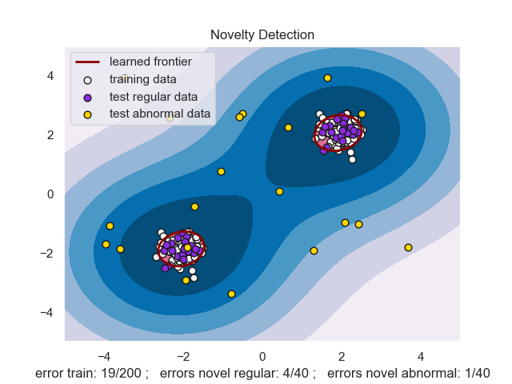

# PySVM : A NumPy implementation of SVM based on SMO algorithm

[](https://pepy.tech/project/pysvm)     

实现LIBSVM中的SVM算法，对标sklearn中的SVM模块

- [x] LinearSVC
- [x] KernelSVC
- [x] NuSVC
- [x] LinearSVR
- [x] KernelSVR
- [x] NuSVR
- [x] OneClassSVM

2021.11.05 : 加入了高斯核函数的RFF方法。

2022.01.27 : 通过向量化运算对算法进行提速，加入性能对比。

2022.01.28 : 加入缓存机制，解决大数据下Q矩阵的缓存问题，参考<https://welts.xyz/2022/01/28/cache/>。

2022.01.30 : 删除Solver类，设计针对特定问题的SMO算法。

2022.02.01 : 修改SVR算法中的错误。

2022.05.27 : 重构代码，将SMO算法求解和SVM解耦，更容易解读。

## 主要算法

Python(NumPy)实现SMO算法，用于求解对偶问题

$$
\begin{aligned}
\min_{\pmb\alpha}\quad\frac12\pmb\alpha^T\pmb Q\pmb\alpha+\pmb p^T\pmb\alpha\\
\text{s.t.}\quad \begin{aligned}\pmb y^T\pmb\alpha&=0\\
0\leq\alpha_i&\leq C,\forall i
\end{aligned}
\end{aligned}
$$

和

$$
\begin{aligned}
\min_{\pmb\alpha}\quad\frac12\pmb\alpha^T\pmb Q\pmb\alpha+\pmb p^T\pmb\alpha\\
\text{s.t.}
\begin{aligned}\quad \pmb y^T\pmb\alpha&=\delta_1\\
\pmb e^T\pmb\alpha&=\sum_{i}\alpha_i=\delta_2\\
0\leq&\alpha_i\leq C,\forall i
\end{aligned}
\end{aligned}
$$

从而实现支持向量机分类、回归以及异常检测。

## Framework

我们实现了线性SVM，核SVM，用于分类，回归和异常检测:



设计框架：



其中RFF表示随机傅里叶特征，LRU Cache缓存机制用于处理极大数据的场景。

## Install

```bash
pip install pysvm
```

或源码安装

```bash
git clone https://github.com/Kaslanarian/PySVM
cd PySVM
python setup.py install
```

运行一个简单例子

```python
>>> from sklearn.datasets import load_iris
>>> from pysvm import LinearSVC
>>> X, y = load_iris(return_X_y=True)
>>> X = (X - X.mean(0)) / X.std(0) # 标准化
>>> clf = LinearSVC().fit(X, y) # 训练模型
>>> clf.score(X, y) # 准确率
0.94
```

## Examples

在[`tests`](./tests)中，有5个例子，分别是：

- [dataset_classify.py](./tests/dataset_classify.py), 使用三种SVM对sklearn自带数据集分类（默认参数、选取20%数据作为测试数据、数据经过标准化）：

    |  Accuracy  |  Iris   |  Wine   | Breast Cancer | Digits  |
    | :--------: | :-----: | :-----: | :-----------: | :-----: |
    | Linear SVC | 94.737% | 97.778% |    96.503%    | 95.556% |
    | Kernel SVC | 97.368% | 97.778% |    96.503%    | 98.222% |
    |   NuSVC    | 97.368% | 97.778% |    92.308%    | 92.222% |

- [dataset_regression.py](./tests/dataset_regression.py), 使用三种SVM对sklearn自带数据集回归（默认参数、选取20%数据作为测试数据、数据经过标准化）：

    |  R2 score  | Boston | Diabetes |
    | :--------: | :----: | :------: |
    | Linear SVR | 0.6570 |  0.4537  |
    | Kernel SVR | 0.6992 |  0.1756  |
    |   NuSVR    | 0.6800 |  0.1459  |

- [visual_classify.py](./tests/visual_classify.py)，分别用LinearSVC和KernelSVC对人工构造的二分类数据集进行分类，画出分类结果图像和决策函数值图像：
  
  

- [visual_regression.py](./tests/visual_regression.py)用三种SVR拟合三种不同的数据：线性数据，二次函数和三角函数：

  

- [visual_outlier.py](./tests/visual_outlier.py)用OneClassSVM进行异常检测：

  

## Reference

- Chang, Chih-Chung, and Chih-Jen Lin. "LIBSVM: a library for support vector machines." ACM transactions on intelligent systems and technology (TIST) 2.3 (2011): 1-27.
- https://github.com/Kaslanarian/libsvm-sc-reading : 阅读LibSVM源码的知识整理与思考.
