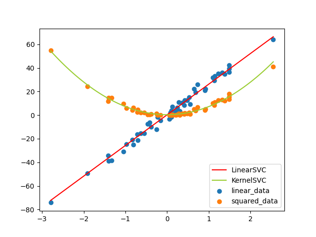
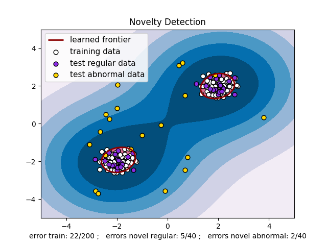

# PySVM

Chinese version : [cnREADME.md](https://github.com/Kaslanarian/PySVM/blob/main/cnREADME.md)

Ues numpy to implement SVM after reading LIBSVM source code. **PySVM** supports classification, regression and outlier detection (same as `sklearn.svm`). In fact, we have built all SVM models in [sklearn](https://scikit-learn.org/stable/auto_examples/index.html#support-vector-machines):

- [x] MultiLinearSVC(equals to `LinearSVC` in sklearn);
- [x] MultiKernelSVC(equals to `SVC` in sklearn);
- [x] MultiNuSVC(equals to `NuSVC` in sklearn);
- [x] LinearSVR(equals to `LinearSVR` in sklearn);
- [x] KernelSVR(equals to `SVR` in sklearn);
- [x] NuSVR(equals to `NuSVR` in sklearn);
- [x] OneClassSVM(equals to `OneClassSVM` in sklearn).

Pay attention to LinearSVC, it is implemented by [LINLINEAR](https://www.csie.ntu.edu.tw/~cjlin/liblinear/) in sklearn, which is a better SVM software.

## Highlight

As a self-made SVM, PySVM has several hightlights:

1. PySVM uses only `numpy` to implement SMO algorithm, without any optimization package such as `cvxopt`;
2. PySVM use caching to calculate Q matrix like LIBSVM, which means it can train any large dataset theoretically.
3. PySVM supports random fourier features(RFF) to calculate Gaussian kernel. It's a nice try because neither LIBSVM nor LIBLINEAR supports it.
4. PySVM uses a similar way to train, test a model and parameter selection compared to `sklearn.svm`, in order to better help you to use.

## How to use

Type the following command to obtain the code:

```bash
git clone https://github.com/Kaslanarian/PySVM
cd PySVM
pip3 install -r requirements.txt
```

There are several examples in `example.py`. They can tell you how to run code. You can start it quickly as long as you know how to use sklearn.

## Experiments

We conduct some experiments to show the distance between our Python models and state-of-art sklearn. Take classfication as examples, we use toy-datasets in `sklearn.datasets`。

|                 Model\Dataset |  Iris  | Breast Cancer |  Wine  | Digits |
| --------------------------: | :----: | :-----------: | :----: | :----: |
|       PySVM.LinearSVC(C=10) | 97.33% |    97.53%     |  100%  | 96.88% |
| sklearn.svm.LInearSVC(C=10) | 96.67% |    98.95%     |  100%  | 99.67% |
|       PySVM.KernelSVC(C=10) | 98.67% |    99.47%     |  100%  |  100%  |
|       sklearn.svm.SVC(C=10) | 98.67% |    99.12%     |  100%  |  100%  |
|          PySVM.NuSVC(ν=0.5) | 97.33% |    95.08%     | 94.38% | 96.93% |
|    sklearn.svm.NuSVC(ν=0.5) | 96.67% |    94.55%     | 98.88% | 96.67% |

We compare the training time(s) below, run 5 times repeatedly and take average:

|                 model\dataset | Iris  | Breast Cancer | Wine  | Digits |
| --------------------------: | :---: | :-----------: | :---: | :----: |
|       PySVM.LinearSVC(C=10) | 0.025 |     0.083     | 0.019 | 1.466  |
| sklearn.svm.LInearSVC(C=10) | 0.007 |     0.008     | 0.002 | 0.191  |
|       PySVM.KernelSVC(C=10) | 0.021 |     0.066     | 0.021 | 1.638  |
|       sklearn.svm.SVC(C=10) | 0.002 |     0.015     | 0.003 | 0.799  |
|          PySVM.NuSVC(ν=0.5) | 0.021 |     0.043     | 0.024 | 1.913  |
|    sklearn.svm.NuSVC(ν=0.5) | 0.004 |     0.032     | 0.005 | 0.628  |

Considering that Python runs much slower than Cpp, our pure-python implementation is not bad.

## Examples

The examples below can be reproduced in `example.py`.

### Classify toy datasets

Take breast dataset as example:

```bash
LinearSVC's perf : 96.49%
KernelSVC's perf : 97.08%
    NuSVC's perf : 97.08%
```

### Regression of self-made dataset



### Regression of toy dataset

Take boston dataset as a example:

```bash
LinearSVR's perf : 0.6836600895151972
KernelSVR's perf : 0.7090334672613672
    NuSVR's perf : 0.5200503832063063
```

### Use one-class SVM to do outlier detection


