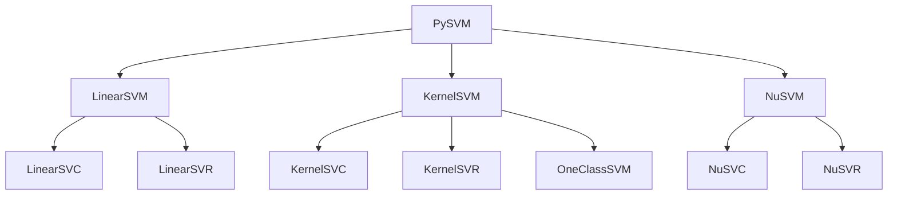
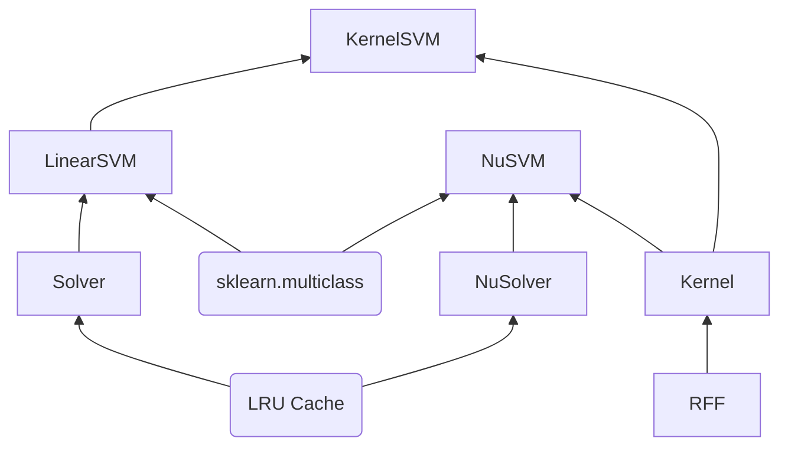
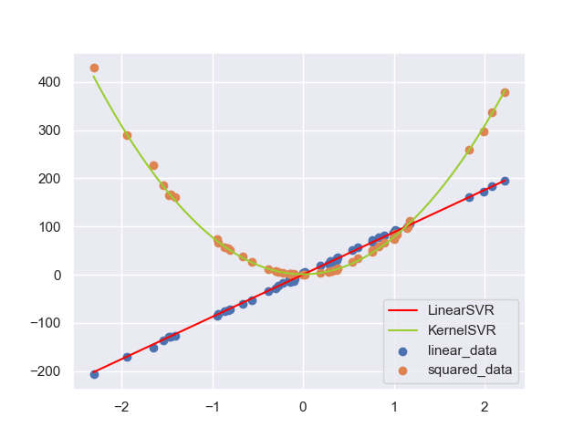

# PySVM : A NumPy implementation of SVM based on SMO algorithm

实现LIBSVM中的SVM算法，对标sklearn中的SVM模块

- [x] LinearSVC
- [x] KernelSVC
- [x] NuSVC
- [x] LinearSVR
- [x] KernelSVR
- [x] NuSVR 
- [x] OneClassSVM

2021.11.05 : 加入了高斯核函数的RFF方法。

2022.01.27 : 通过向量化运算对算法进行提速，加入性能对比。

2022.01.28 : 加入缓存机制，解决大数据下Q矩阵的缓存问题，参考<https://welts.xyz/2022/01/28/cache/>。

2022.01.30 : 删除Solver类，设计针对特定问题的SMO算法。

2022.02.01 : 修改SVR算法中的错误。

2022.05.27 : 重构代码，将SMO算法求解和SVM解耦，更容易解读。

## 主要算法

Python(NumPy)实现SMO算法，也就是


和


的优化算法，从而实现支持向量机分类、回归以及异常检测。

## Framework

我们实现了线性SVM，核SVM，用于分类，回归和异常检测:



设计框架：



其中RFF表示随机傅里叶特征，LRU Cache缓存机制用于处理极大数据的场景。

## Install

输入

```bash
git clone https://github.com/Kaslanarian/PySVM
cd PySVM
python setup.py install
```

进行安装，运行一个简单例子

```python
>>> from sklearn.datasets import load_iris
>>> from pysvm import LinearSVC
>>> X, y = load_iris(return_X_y=True)
>>> X = (X - X.mean(0)) / X.std(0) # 标准化
>>> clf = LinearSVC().fit(X, y) # 训练模型
>>> clf.score(X, y) # 准确率
0.94
```

## Examples

在[`tests`](.tests/)中，有三个例子，分别是：

- 使用三种SVM对sklearn自带数据集分类（默认参数、选取20%数据作为测试数据、数据经过标准化）：

  |            |  Iris   |  Wine   | Breast Cancer | Digits  |
  | :--------: | :-----: | :-----: | :-----------: | :-----: |
  | Linear SVC | 97.368% |  100%   |     100%      |  100%   |
  | Kernel SVC | 97.778% | 97.778% |    96.503%    | 95.105% |
  |   NuSVC    | 87.413% | 95.111% |    97.778%    | 91.556% |

- 用SVR拟合数据：

  

- 用OneClassSVM进行异常检测：

  

## Current work

1. 自实现的NuSVM在各种情况下表现不好，正在查找问题；
2. 文档的撰写。

## Reference

- Chang, Chih-Chung, and Chih-Jen Lin. "LIBSVM: a library for support vector machines." ACM transactions on intelligent systems and technology (TIST) 2.3 (2011): 1-27.
- https://github.com/Kaslanarian/libsvm-sc-reading : 阅读LibSVM源码的知识整理与思考.
