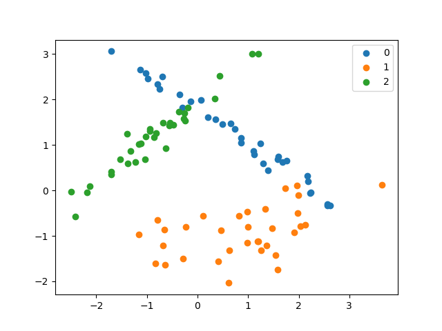

# PySVM

实现LIBSVM中的SVM算法，对标sklearn中的SVM模块

- [x] LinearSVC
- [x] SVC
- [x] NuSVC
- [x] LinearSVR
- [x] SVR
- [x] NuSVR
- [x] OneClassSVM

2021.11.05 : 加入了高斯核函数的RFF方法。

2022.01.27 : 通过向量化运算对算法进行提速，加入性能对比。

2022.01.28 : 加入缓存机制，解决大数据下Q矩阵的缓存问题，参考<https://welts.xyz/2022/01/28/cache/>。

2022.01.30 : 删除Solver类，设计针对特定问题的SMO算法。

2022.02.01 : 修改SVR算法中的错误。

2022.05.27 : 重构代码，将SMO算法求解和SVM解耦，更容易解读。

## 主要算法

Python(NumPy)实现SMO算法，也就是


和


的优化算法，从而实现支持向量机分类、回归以及异常检测。

## Install

输入

```bash
git clone https://github.com/Kaslanarian/PySVM
cd PySVM
python setup.py install
```

进行安装，运行一个简单例子

```python
>>> from sklearn.datasets import load_iris
>>> from pysvm import LinearSVC
>>> X, y = load_iris(return_X_y=True)
>>> X = (X - X.mean(0)) / X.std(0) # 标准化
>>> clf = LinearSVC().fit(X, y) # 训练模型
>>> clf.score(X, y) # 准确率
0.94
```

## SVM效果及可视化

我们在`example.py`中通过测试函数介绍了这些模型的用法，并将测试结果打印或可视化出来：

### 自制数据集的分类



分类结果(默认参数，并没有调参)

```python
LinearSVC's perf : 83.33%
KernelSVC's perf : 83.33%
    NuSVC's perf : 83.33%
```

### 对sklearn自带数据集分类

以breast_cancer数据集为例：

```python
LinearSVC's perf : 96.49%
KernelSVC's perf : 97.08%
    NuSVC's perf : 94.74%
```

### 基于随机傅里叶特征(RFF)的SVC

以breast_cancer数据集为例：

```python
RBF-KernelSVC's perf : 97.08%, RFF-KernelSVC's perf : 95.91%
RBF-NuSVC's perf : 94.74%, RFF-NuSVC's perf : 94.74%
```

### 自制数据集进行回归

分别用线性核和二次多项式核对两种数据进行回归：


### 对sklearn自带数据集回归

以boston数据集为例：

```python
dataset : load_boston
LinearSVR's perf : 0.6718188093886592
KernelSVR's perf : 0.8587363109159876
    NuSVR's perf : 0.7779371361462216
```

### 自制数据集对OneClassSVM测试

自制带异常点的数据集，用OneClassSVM进行异常检测，并可视化：


